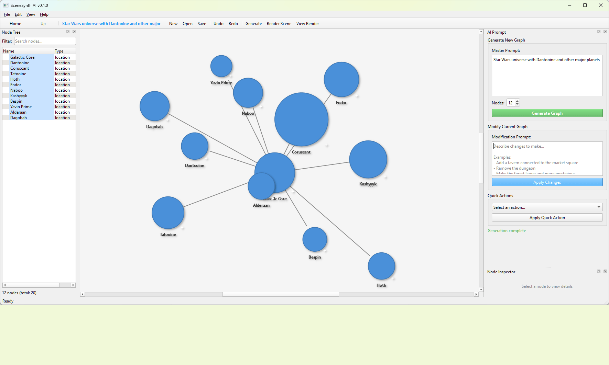
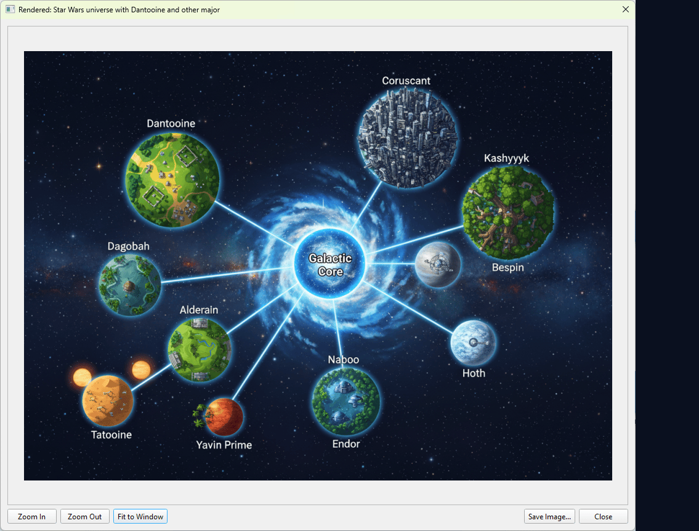
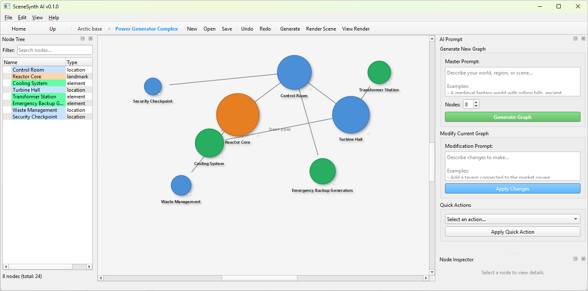
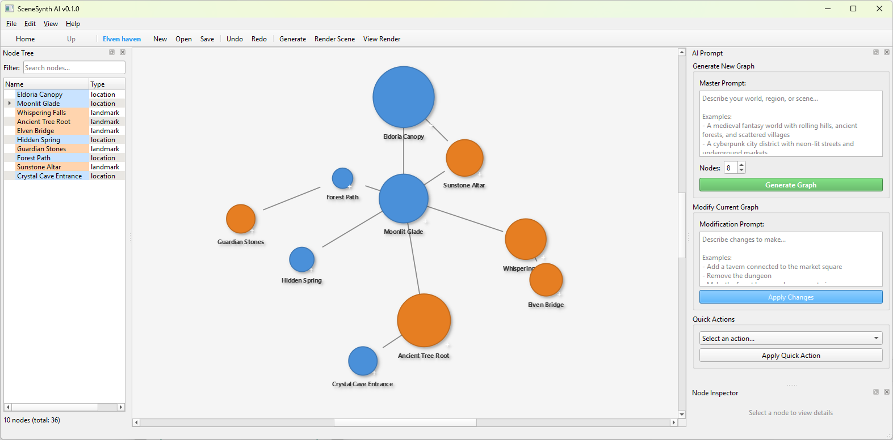
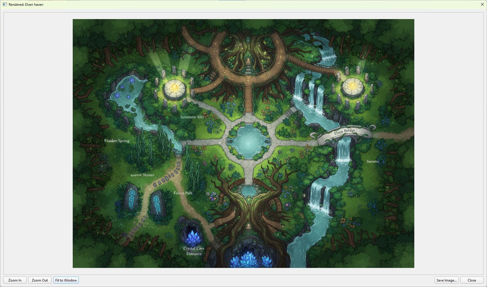
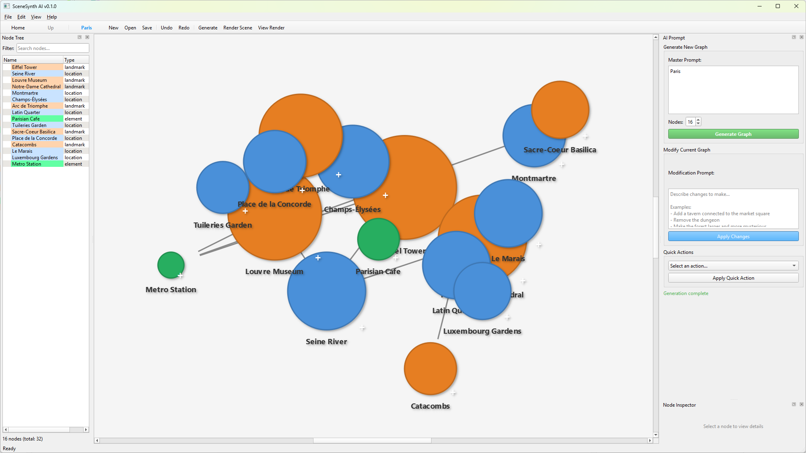
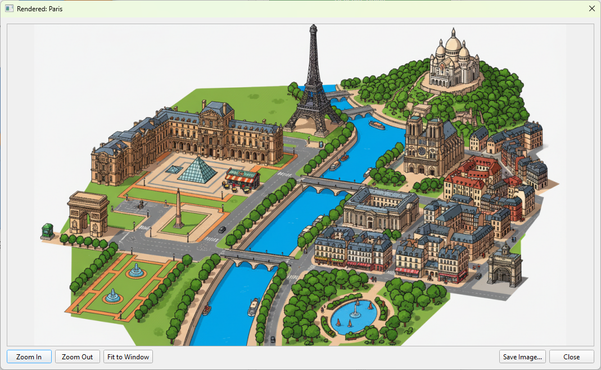

<p align="center">
  <h1 align="center">SceneSynth</h1>
  <p align="center">
    <strong>AI-Powered Hierarchical Scene Graph Generator for 2D Level Design</strong>
  </p>
  <p align="center">
    Transform natural language into explorable, nested world structures
  </p>
  <p align="center">
    
    
  </p>
  <p align="center">
    <em>Powered by Gemini + Nano Banana (gemini-2.5-flash-image)</em>
  </p>
</p>

---

## What is SceneSynth?

SceneSynth is a desktop application that generates **semantic scene graphs** from text prompts using AI. Describe a world, and watch it materialize as an interactive node graph. Each node can be expanded into its own detailed sub-graph, enabling infinite hierarchical world-building—from continents down to individual rooms.

**Then bring your scenes to life** with **Nano Banana** (`gemini-2.5-flash-image`)—Google's native image generation model—which renders your semantic graphs into vivid scene illustrations.

---

## Key Features

- **Natural Language to Scene Graph** — Describe your world in plain text; AI generates a structured graph
- **Recursive Drill-Down** — Double-click any node to expand it into a detailed child graph
- **Semantic Positioning** — Nodes are placed meaningfully (sky elements at top, underground at bottom)
- **Graph Modification via Chat** — Refine your scene with instructions like *"Add a tavern near the market"*
- **Nano Banana Rendering** — Transform your graphs into stunning visuals with `gemini-2.5-flash-image`
- **Multiple Art Styles** — Fantasy, photorealistic, pixel art, watercolor, anime, and custom styles
- **Full Project Persistence** — Save/load entire hierarchies including rendered images

---

## Nano Banana: AI Scene Rendering

SceneSynth leverages **Nano Banana** (`gemini-2.5-flash-image`), Google's native multimodal image generation model via Vertex AI, to render your semantic graphs as actual scene artwork.

| Semantic Scene Graph | Nano Banana Render |
|:-------------------:|:------------------:|
|  |  |
|  |  |
|  |  |

**How it works:**
1. Your scene graph (nodes, relationships, spatial layout) is serialized to JSON
2. A screenshot of your graph canvas is captured
3. Both are sent to Nano Banana with your chosen art style
4. The model generates a cohesive scene illustration respecting the semantic layout

**Available Styles:**
- Top-down 2D Game Art
- Fantasy Illustration
- Photorealistic
- Pixel Art (16-bit)
- Watercolor
- Anime/Manga
- Dark Fantasy
- Isometric
- *Custom prompts supported*

Rendered images are stored with each graph and persist across save/load cycles.

---

## Prerequisites

> **Important:** SceneSynth requires Google Cloud services for AI functionality.

| Requirement | Purpose |
|-------------|---------|
| **Google Cloud Account** | Access to Vertex AI services |
| **Vertex AI API** | Must be enabled in your GCP project |
| **Gemini API Key** | For graph generation ([Get one here](https://aistudio.google.com/app/apikey)) |
| **GCP Project ID** | For image rendering via Vertex AI |
| **gcloud CLI** | For authentication |

### Authentication Setup

```bash
# Install gcloud CLI if needed, then authenticate:
gcloud auth application-default login
```

---

## Installation

```bash
# Clone the repository
git clone https://github.com/yourusername/SceneSynth.git
cd SceneSynth

# Install dependencies
pip install -r requirements.txt

# Run the application
python main.py
```

### Dependencies

- Python 3.10+
- PyQt6
- google-genai
- networkx
- pydantic

---

## Configuration

1. Launch SceneSynth
2. Go to **Edit → API Settings**
3. Enter your **Gemini API Key** (for graph generation)
4. Enter your **GCP Project ID** (for image rendering)
5. Click **Save**

---

## Quick Start

1. **Generate a World** — Enter a prompt like *"A medieval fantasy kingdom with diverse regions"* and click Generate
2. **Explore the Graph** — Pan, zoom, and select nodes to view their details
3. **Drill Down** — Double-click any node to generate a detailed sub-graph
4. **Modify with Language** — Use the prompt panel to add, remove, or change elements
5. **Render Scenes** — Click "Render Scene" to generate an AI visualization
6. **Save Your Work** — File → Save Project to preserve your entire hierarchy

---

## How It Works

```
┌─────────────────┐     ┌─────────────────┐     ┌─────────────────┐
│  Text Prompt    │ ──▶ │   Gemini LLM    │ ──▶ │  Scene Graph    │
│  "A forest..."  │     │  (Structured)   │     │  (Nodes/Edges)  │
└─────────────────┘     └─────────────────┘     └─────────────────┘
                                                        │
                                                        ▼
                                               ┌─────────────────┐
                                               │  Interactive    │
                                               │  Canvas (PyQt)  │
                                               └─────────────────┘
```

SceneSynth uses **structured output** from Gemini to generate semantically meaningful graphs. Each node contains:
- Name and description
- Semantic type (location, landmark, character, etc.)
- Spatial coordinates for meaningful layout
- Expandability flag for drill-down capability

The hierarchy manager maintains parent-child relationships between graphs, enabling seamless navigation through nested worlds.

---

## Project Structure

```
SceneSynth/
├── main.py                 # Entry point
├── config.py               # App configuration
├── core/
│   ├── graph/              # Scene graph data structures
│   ├── llm/                # AI providers and prompts
│   └── state/              # Application state management
└── ui/
    ├── main_window.py      # Main application window
    └── widgets/            # UI components
```

---

## License

MIT License — Feel free to use, modify, and distribute.

---

<p align="center">
  <sub>Built with PyQt6 and Google Gemini</sub>
</p>
